# Yoggis
## A healthy life, in the palm of your hands

Yoggis is an Artificial Intelligence Yoga trainer app that looks after your posture when you try different yoga positions. Basically, a personalized, on-demand yoga instruction from a virtual AI assistant that provides real-time feedback.

---

## What problems are we trying to solve?

People want to stay fit with simple yoga activities. Not only that, some chronic health problems like back pain also requires yoga exercises recommended by physicians. But even the slightest mistake in posture can lead to serious health problems. 

---
## Data and Statistics
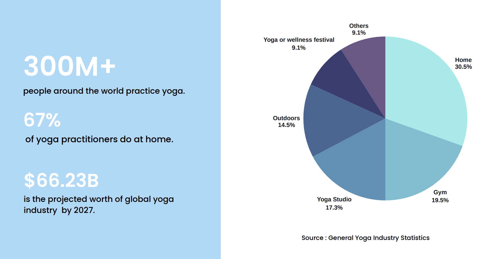

---
## How are we solving it?
Our app <b>Yoggis</b> is an AI based yoga trainer app that can help you to do yoga in the right way. It can not only suggest you yoga exercises but also guide your posture in every step and help you to lead your life to a better and healthy life. We will guide the user with audio feedback.

---
## What features do Yoggis have?
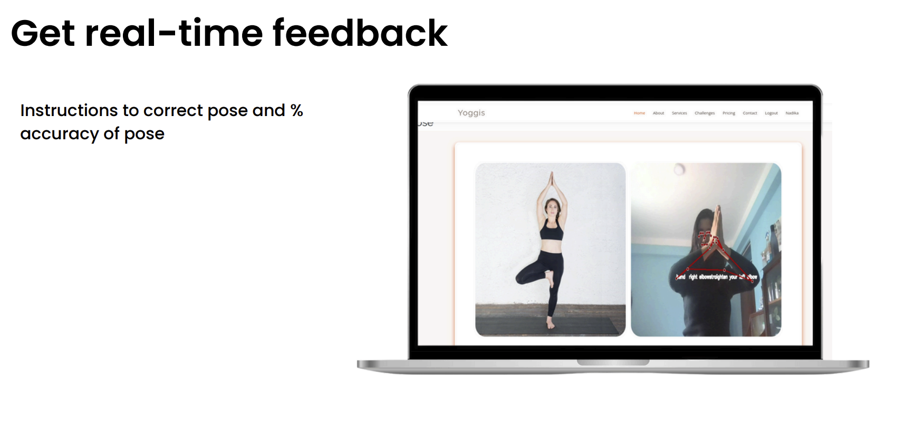
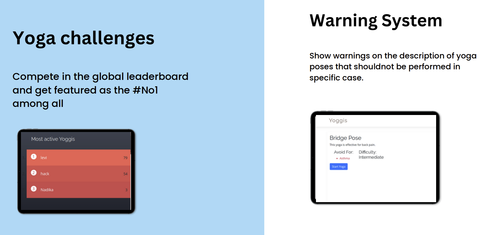
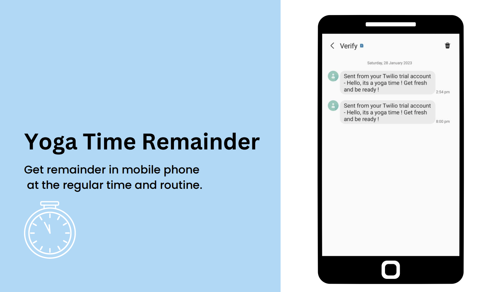
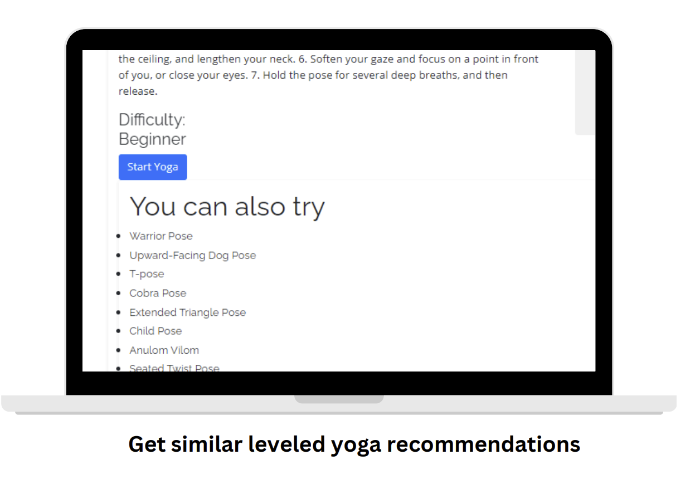
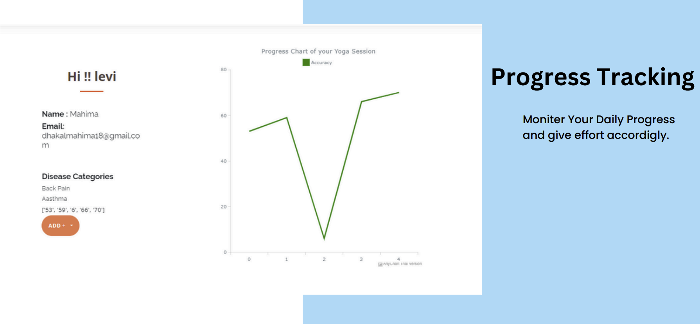

---
## System Diagram

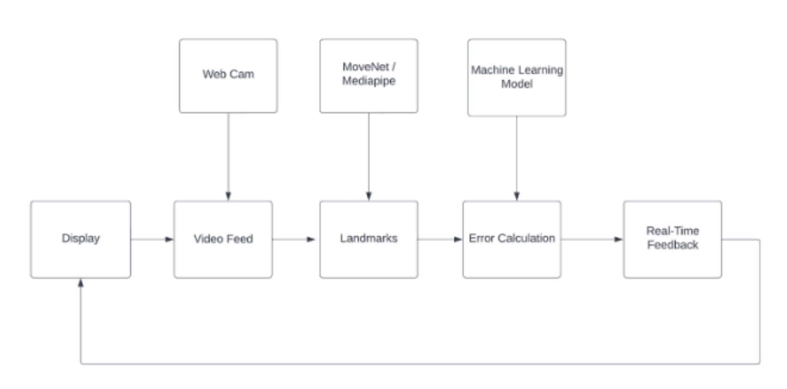

---
## Pose Detection
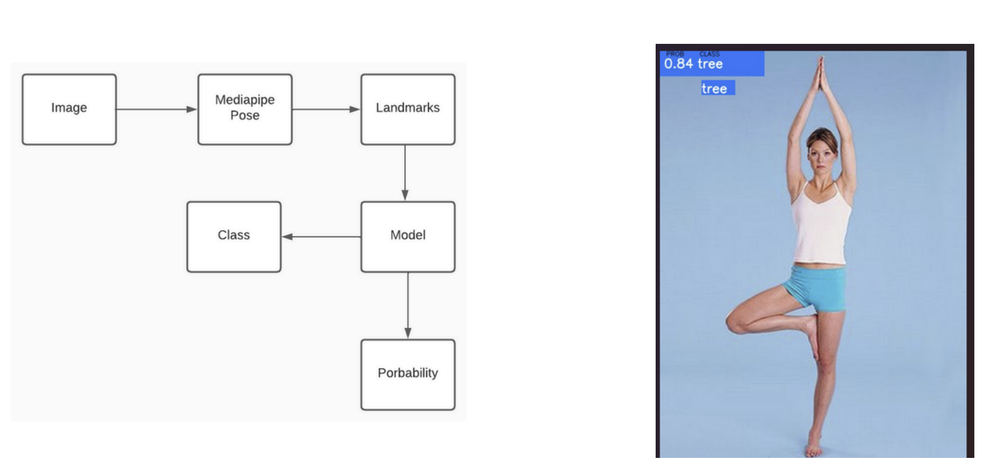

---
## Error Management
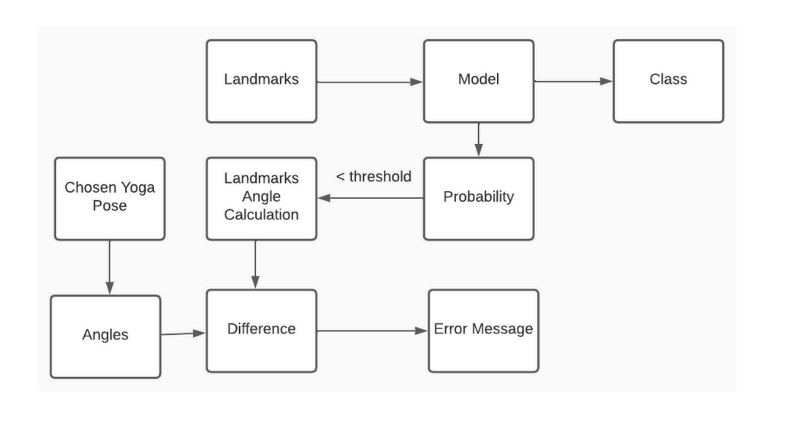

---
## Results
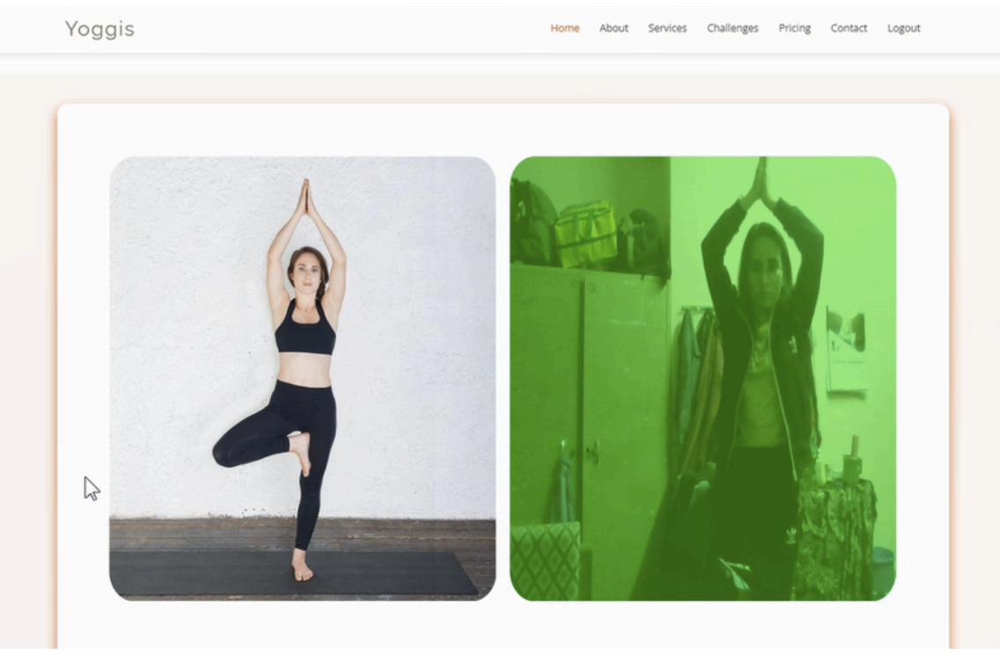
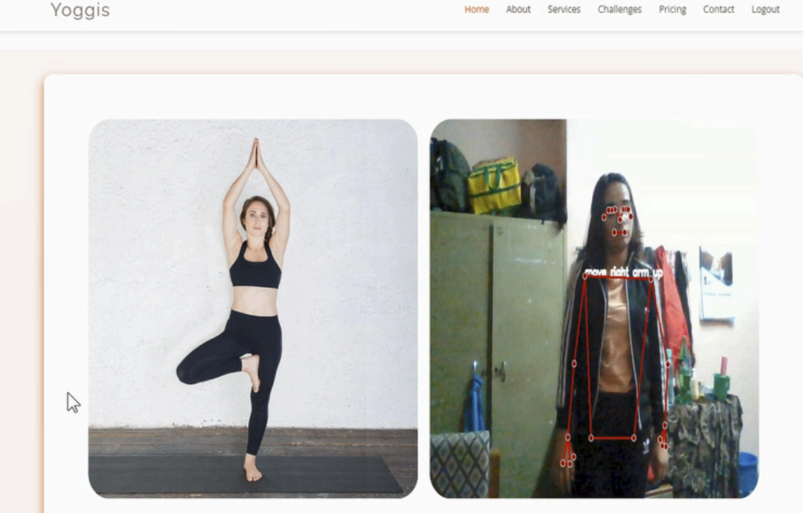

---
## What technologies are we using?

---
## Business Model
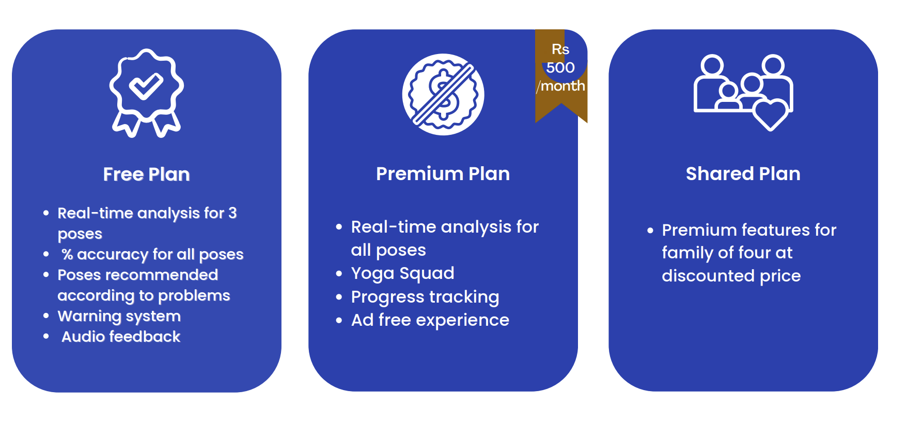

---
## Future Enhancements
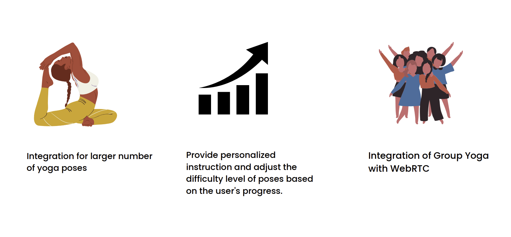

---
## Thank You!

